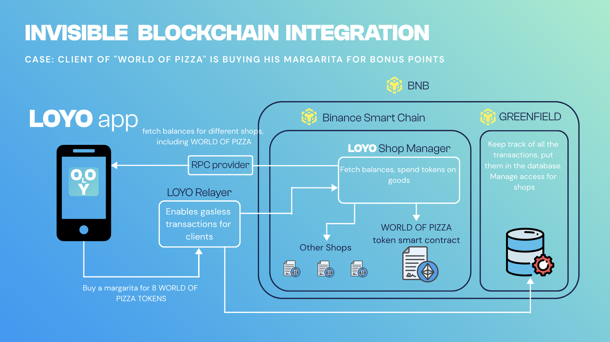
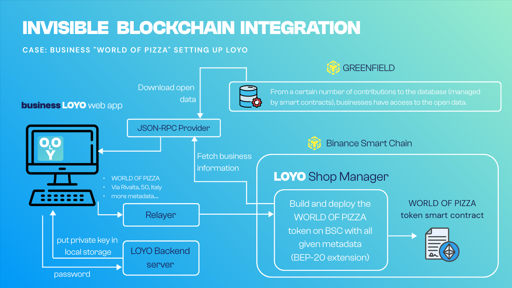

Loyo is the new generation loyalty program infrastructure.

### For clients: 
- no personal data required to get and spend loyalty rewards
- easy-to-use application, all commercials promos at one place

### For businesses: 
- 500x less infrastructure costs
- open decentralized data about clients' transactions with endless insight opportunities.

### Check our pitch deck and demo!:
https://pitch.com/public/71f1c5f5-f052-40e3-9867-873ae42f7eaf

# Technical description

## Client Application


Currently, Loyo is accessible only on IOS devices. 
It's a Swift application. This application is
connected to the blockchain using QuickNode infrastructure.
This application allows clients to get, spend and share tokens
of different shops.

Key technical decisions:

- use relayer to enable gazless transaction (clients will not pay anything) 🚧 !under construction!
- each shop is a bep-20 smart contract extended with metadata
- use shop manager contract to know which tokens are held by every user
- connect LOYO app to the GREENFIELD. see `/backend_data_collecter_layer`


## Set Up For Businesses 🚧 under construction


When businesses want to use Loyo, they have to set up their 
business token. They can easily do this using the frontend. 
This frontend will call the Shop Manager contract 
that will build 
and deploy the token for business

## Greenfield integration

See ```backend_data_collecter_layer/```


### Running project locally:
- To run the project locally, please, check `./contract` README.
    - You'll have to execute a very simple bash script to deploy smart contracts and register a user.
- We also tried tried to implement GSN-capable smart contracts for meta-transactions, check it in `./gsn-contracts` README.

## Swift application frontend
See ```app/```

## Swift application connection with the blockchain and test

See ```contracts/```

## OpenGSN compatible contracts - gasless transactions

See ```gsn-contracts/```

We are planning to add support for gasless transactions. The user will not require BNB tokens to pay with loyalty points. 
We made our contracts GSN-capable by implementing ERC2771Recipient contract. We tested it through a simple UI with Metamask and it works. However, we didn't finish the implementation of EIP-712 signatures in Swift. Check more in details in `gsn-contracts` folder`.