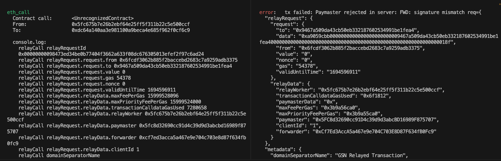

# Loyo GSN-capable smart contracts

This project demonstrates a possibility to pay users' transactions increase the adoption, simplify the onboarding and abstract the notion of the blockchain from final users. 
### Getting started
- Before to start, replace ordinary payment function by the gasless one
    - Replace `try await blockchainConnector.executePayment` by `try await blockchainConnector.executeRelayedPayment` in `app/Loyo/SelectedTokenView`  
- Build & Launch Loyo application
- Scan the QR code shown on the main page and copy the address
- Open `gsn-contracts/scripts/deploy.ts` and update `USER_ADDRESS` with the copied address value
- Install dependencies: `yarn`
- Open 3 terminals and run the following scripts from `./gsn-contracts` folder:
```shell
npx hardhat node # launch a local node
npx gsn start # deploy gsn contracts and launch a relay server
npx hardhat run scripts/deploy.ts # deploy and initiate smart contracts
```
- Open XCode and update `app/Loyo/BlockchainConnectors.swift` file:
    - copy PAYMASTER_ADDRESS, FORWARDER_ADDRESS and RELAY_SERVER values from `npx gsn start` terminal
    - update NODE_RPC with your rpc ("http://127.0.0.1:8545" for localhost)
    - copy SHOP_AGGREGATOR_ADDRESS from `npx hardhat run scripts/deploy.ts` terminal
- Rebuild and rerun the app
- You will be able to query data and submit transactions, but gasless transactions do not work yet. Check ⚠️ Issues section below.

🪄 Smart contracts:
- Shop aggregator: creates and manages shops contracts
- Shop: registers and manages users and shop's metadata
- Client: signs & sends meta transaction to relay server
- Relay server: submits a transaction and pays protocol gas fees for doing so
- Paymaster: agrees to refund relay server for gas fees
- Forwarder: verifies sender signature and nonce
- Recipient contract: sees the original sender and executes the original transaction
- RelayHub: coordinates the process in a trustless way

⚠️ Issues:
Loyo app doesn's support yet EIP-712 signatures. The app can broadcast transaction to Forwarder, but it's rejected due to the invalid signature (the screen below). The purpose of this package is to show that it's possible to enable gasless transactions. 

